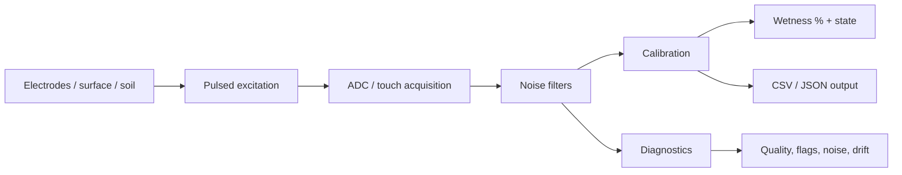

<!-- PulseWetProbe local GitHub banner: PNG asset stored inside this repository. -->
<p align="center">
  
</p>

<h1 align="center">PulseWetProbe</h1>

<p align="center">
  <b>MCU-only Arduino library for pulsed two-electrode wetness, soil-moisture trend, surface wet/dry state, calibration, diagnostics, CSV/JSON logging, and anti-corrosion Hi-Z rest behavior.</b>
</p>

<p align="center">
  <a href="https://github.com/Parvaz-Jamei/PulseWetProbe-Arduino/actions/workflows/arduino-lint.yml"></a>
  <a href="https://github.com/Parvaz-Jamei/PulseWetProbe-Arduino/actions/workflows/compile-examples.yml"></a>
  <a href="https://github.com/Parvaz-Jamei/PulseWetProbe-Arduino/actions/workflows/host-smoke.yml"></a>
  <br>
  
  
  
  
</p>

<p align="center">
  <a href="#-why-pulsewetprobe">Why</a> •
  <a href="#-quick-start">Quick Start</a> •
  <a href="#-hardware-wiring">Hardware</a> •
  <a href="#-installation">Installation</a> •
  <a href="#-api-at-a-glance">API</a> •
  <a href="#-examples">Examples</a> •
  <a href="#-validation--non-claims">Validation</a> •
  <a href="#-documentation-map">Docs</a>
</p>

---

## 🌱 Why PulseWetProbe?

Most wetness and soil-moisture experiments start simple: two electrodes, one analog input, one GPIO, and a lot of noisy readings. **PulseWetProbe** turns that rough prototype into a reusable Arduino library with:

| What you need | What the library gives you |
| --- | --- |
| Simple soil/wetness readings | Beginner wrappers like `beginSoil()` and `beginWetDry()` |
| Less electrode stress | Pulsed excitation plus Hi-Z rest between readings |
| Better repeatability | Dry/wet calibration, optional multi-point calibration, board-aware ADC defaults |
| Cleaner logs | Fixed-buffer CSV output and optional JSON on larger boards |
| Debug visibility | Quality score, state labels, diagnostic flags, noise/stability/drift indicators |
| Cross-board behavior | AVR-safe Tiny mode, ESP32 touch guard, SAMD/Renesas/RP2040/STM32/Teensy-friendly defaults |

> [!IMPORTANT]
> PulseWetProbe reports **trend-oriented wetness and conductivity-response indicators**. It is not a certified RWIS sensor, laboratory EC meter, salinity meter, freezing-point detector, or corrosion-proof hardware solution. Validate your own electrode geometry, medium, cable length, enclosure, and environment before using the readings for decisions.

---

## ⚡ Quick Start

Use the beginner wrapper first. Replace the calibration values with your own measured dry/wet readings.

```cpp
#include <PulseWetProbe.h>

PulseWetProbe probe;

void setup() {
  Serial.begin(115200);

  // sense pin, excitation pin
  probe.beginSoil(A0, 7);

  // replace these with your measured dry/wet raw values
  probe.calibrateDryWet(120, 850);

  Serial.println(F("wetnessPercent,state,quality"));
}

void loop() {
  PwpReading r = probe.read();

  Serial.print(r.wetnessPercent(), 1);
  Serial.print(F(","));
  Serial.print(r.stateName());
  Serial.print(F(","));
  Serial.println(r.qualityScore);

  delay(probe.nextIntervalMillis());
}
```

Typical serial output:

```text
wetnessPercent,state,quality
3.8,dry,94
28.6,damp,88
71.2,wet,82
95.5,saturated,76
```

---

## 🧠 How it works

PulseWetProbe samples a two-electrode path using short excitation pulses, then returns the pins to a safer resting state. The library separates **level**, **differential behavior**, and **trend diagnostics** so you can log meaningful signals instead of hiding everything behind one raw ADC value.



### Reading model

| Signal | Meaning | Use it for |
| --- | --- | --- |
| `rawForward` / `rawReverse` | Forward/reverse acquisition values | Hardware debugging, polarity asymmetry checks |
| `rawAverage` | Average raw response | Basic trend logging |
| `filtered` | Filtered sensor response | Calibration and stable display values |
| `normalizedWetness` | Calibrated 0.0–1.0 wetness estimate | UI, thresholds, dashboards |
| `wetnessPercent()` | User-friendly 0–100% wrapper | Serial output and beginner projects |
| `differentialIndex` | Forward/reverse imbalance | Cable/electrode/polarization trend checks |
| `conductivityTrend` | Heuristic trend/change score | Relative conductivity-response experiments, not EC |
| `qualityScore` | 0–100 confidence-style score | Flagging readings that deserve attention |
| `stateName()` | `dry`, `damp`, `wet`, `saturated`, `unstable`, `needs_calibration` | Human-readable output |

---

## 🔌 Hardware wiring

### Minimal two-plate wiring

```text
Arduino / MCU

GPIO excitation pin ──[ series resistor ]── Plate A
Analog sense pin  ───────────────────────── Plate B
GND/reference     ──[ high-value bleed ]──── Plate B  (optional but recommended when dry node floats)
```

Recommended starting points:

| Part | Why it matters | Typical starting point |
| --- | --- | --- |
| Series resistor on excitation path | Limits current during accidental shorts and wet conductive conditions | Start high; tune for your ADC range and electrode geometry |
| High-value bleed/reference path on sense node | Prevents floating readings when the electrodes are dry or disconnected | Use a high value so it does not dominate the measurement |
| Short, shielded, or twisted wiring when possible | Reduces pickup/noise on high-impedance analog nodes | Especially important outdoors or near motors/relays |
| Enclosure and ESD protection | Outdoor electrodes can collect static, water, salts, and cable transients | Validate for your deployment environment |

> [!CAUTION]
> Do not connect electrodes directly to unknown high-energy sources. Keep current limited, verify the board pin limits, and review `docs/ELECTRODE_SAFETY.md`, `docs/EMC_ESD_GUIDE.md`, and `docs/HARDWARE_WIRING_AND_SCHEMATICS.md` before field use.

### Two supported acquisition styles

| Mode | API | What happens | Best for |
| --- | --- | --- | --- |
| High/low pulsed two-plate | `beginTwoPlate(sense, excite)` or `beginSoil()` | One pin drives HIGH/LOW pulses, the other pin is sensed | Simple Arduino projects, low pin count, AVR-safe examples |
| Reversible two-plate | `beginReversibleTwoPlate(plateA, plateB)` | Plate roles are swapped during sampling | Better electrode role balancing when both pins are safe for drive/sense |
| ESP32 touch wetness | `beginEsp32TouchWetness(touchPin)` | Uses ESP32 touch hardware when available | ESP32 boards with verified touch-capable GPIOs |

---

## 📦 Installation

### Arduino IDE — before Library Manager acceptance

1. Download the release ZIP from GitHub.
2. Open Arduino IDE.
3. Go to **Sketch → Include Library → Add .ZIP Library...**
4. Open **File → Examples → PulseWetProbe → SimpleSoilStarter**.
5. Set your pins and calibration values.
6. Upload and open Serial Monitor.

### Arduino IDE — after Library Manager acceptance

1. Open **Tools → Manage Libraries...** or **Sketch → Include Library → Manage Libraries...**
2. Search for **PulseWetProbe**.
3. Install the latest version.
4. Open an example from **File → Examples → PulseWetProbe**.

### Arduino CLI

After Library Manager acceptance:

```bash
arduino-cli lib install PulseWetProbe
```

Before acceptance, install manually from a local ZIP or clone this repository into your Arduino libraries folder.

### PlatformIO

Before registry publication:

```ini
lib_deps = https://github.com/Parvaz-Jamei/PulseWetProbe-Arduino.git
```

After registry publication:

```ini
lib_deps = PulseWetProbe
```

---

## 🧩 API at a glance

### Beginner API

| API | Purpose |
| --- | --- |
| `beginSoil(sensePin, excitePin)` | Soil/moisture trend starter defaults |
| `beginWetDry(sensePin, excitePin)` | Faster surface wet/dry state sensing |
| `beginConductivityTrend(sensePin, excitePin)` | Relative conductivity-response trend logging; not EC/salinity precision |
| `beginEsp32TouchWetness(touchPin)` | ESP32 touch wetness path when board and pin support touch |
| `calibrateDryWet(dryRaw, wetRaw)` | Simple two-point calibration |
| `read()` | Take one reading and return a `PwpReading` |
| `wetnessPercent()` | Latest wetness as 0–100% |
| `stateName()` | Latest state as readable text |
| `nextIntervalMillis()` | Conservative adaptive sampling interval |

### Advanced configuration

```cpp
probe.enableBoardDefaults();
probe.beginTwoPlate(A0, 7);
probe.setProfile(PwpProfile::SOIL);
probe.setExcitation(PwpExcitation::PULSED_HIGH_LOW);
probe.filters().setPreset(PwpFilterPreset::INDUSTRIAL_STABLE);
probe.acquisition().setSettlingMicros(100).setDummyReads(2).setBurstSamples(8);
probe.calibration().setDryWet(120, 850);
```

### Profiles

| Profile | Intent |
| --- | --- |
| `PwpProfile::SOIL` | Soil-moisture trend sensing |
| `PwpProfile::WETNESS` | Surface wet/dry response |
| `PwpProfile::CONDUCTIVITY_TREND` | Relative conductivity-response trend experiments |
| `PwpProfile::SURFACE_BRINE_TREND` | Brine-like surface trend experiments; not salinity/freezing-point detection |
| `PwpProfile::DIAGNOSTIC` | More diagnostic visibility for testing and validation |

### Filter presets

| Preset | Behavior |
| --- | --- |
| `PwpFilterPreset::RESPONSIVE` | Faster response, less smoothing |
| `PwpFilterPreset::STABLE` | Balanced smoothing |
| `PwpFilterPreset::INDUSTRIAL_STABLE` | More conservative output for noisy wiring/environments |

---

## 🎯 Calibration guide

Calibration is required because the raw ADC response depends on electrode size, spacing, material, board ADC range, wiring, soil/surface material, and environmental conditions.

### Simple dry/wet calibration

1. Wire the electrodes safely.
2. Run `examples/ManualCalibrationConsole` or `examples/CsvLogger`.
3. Capture a stable **dry** raw value.
4. Capture a stable **wet/reference** raw value.
5. Apply them:

```cpp
probe.calibrateDryWet(dryRaw, wetRaw);
```

### Multi-point calibration

On non-Tiny profiles, you can add intermediate reference points:

```cpp
probe.calibration().clearPoints();
probe.calibration().addPoint(120, 0.00f);  // dry
probe.calibration().addPoint(420, 0.35f);  // damp
probe.calibration().addPoint(850, 1.00f);  // wet
```

Calibration profiles can be exported with CRC-16 protection so corrupted profiles are rejected during import.

---

## 🧾 Output formats

### CSV — recommended for AVR and logging

```cpp
char line[PWP_CSV_BUFFER_SIZE];
PwpReading r = probe.read();

if (r.toCsv(line, sizeof(line)) > 0) {
  Serial.println(line);
}
```

CSV columns:

```text
seq,ms,rawForward,rawReverse,rawDiff,rawAvg,filtered,touchRaw,burstSpread,wetPermille,levelPermille,diffPermille,trendPermille,quality,noise,stability,drift,fouling,state,flags
```

### JSON — available on larger targets when enabled

```cpp
#if PWP_ENABLE_JSON
char json[PWP_JSON_BUFFER_SIZE];
PwpReading r = probe.read();

if (r.toJson(json, sizeof(json)) > 0) {
  Serial.println(json);
}
#endif
```

> [!TIP]
> On AVR/Tiny mode, prefer `toCsv(char*, size_t)` and avoid heap-heavy `String` output.

---

## 🛠️ Board support

| Board family | Default mode | Notes |
| --- | --- | --- |
| AVR UNO/Nano/Mega | Tiny | Fixed buffers, CSV-first, small RAM behavior |
| megaAVR Nano Every / Uno WiFi Rev2 class | Core | Detected before classic AVR so it is not forced into Tiny mode |
| ESP8266 | Core | One user ADC channel; avoid multi-channel assumptions |
| ESP32 classic/S2/S3/C3/C6 | ESP32-aware | Touch mode only when board/core/GPIO support it |
| SAMD | Core/Full-capable | Uses generic Arduino APIs first |
| Renesas UNO R4 | Core/Full-capable | Board-aware defaults and example compile coverage |
| RP2040 / Mbed RP2040 | Core/Full-capable | Specific RP2040 detection before generic Mbed path |
| STM32 | Core/Full-capable | Generic Arduino APIs first |
| Teensy | Core/Full-capable | Generic Arduino APIs first |
| nRF52 / Mbed / Nano 33 BLE class | Core/Full-capable | Generic Arduino APIs first |

Run this example to see what the library detects on your board:

```text
examples/BoardCapabilityReporter
```

---

## 🧪 Examples

| Example | Start here when you want to... |
| --- | --- |
| `SimpleSoilStarter` | Get a friendly wetness percentage and state quickly |
| `BasicTwoPlateSoil` | Log calibrated soil trend readings as CSV |
| `PulsedWetDryPlate` | Detect wet/dry surface response with pulsed excitation |
| `FilterComparisonLogger` | Compare responsive vs stable filtering |
| `ManualCalibrationConsole` | Capture dry/wet calibration points from Serial Monitor |
| `CsvLogger` | Produce compact CSV for spreadsheets, dashboards, or Python plots |
| `BoardCapabilityReporter` | Print detected board capabilities and compile profile |
| `DiagnosticsProLogger` | Log quality, flags, noise, drift, fouling indicators |
| `MultiPointCalibrationConsole` | Use multiple calibration points and CRC profile export |
| `PowerAwareSampler` | Use adaptive sampling interval logic |
| `JsonFullModeLogger` | Emit JSON on boards where JSON output is enabled |
| `Esp32TouchWetness` | Try ESP32 touch wetness with automatic fallback |
| `ReversibleTwoPlateBalance` | Use true two-electrode role swapping |

---

## 🏗️ Project structure

```text
PulseWetProbe-Arduino/
├── src/
│   ├── PulseWetProbe.h
│   ├── PulseWetProbe.cpp
│   ├── PwpConfig.h
│   └── PwpBoardCapabilities.h
├── examples/
│   ├── SimpleSoilStarter/
│   ├── CsvLogger/
│   ├── DiagnosticsProLogger/
│   └── ...
├── docs/
│   ├── API_GUIDE.md
│   ├── BOARD_SUPPORT_MATRIX.md
│   ├── HARDWARE_WIRING_AND_SCHEMATICS.md
│   ├── ELECTRODE_SAFETY.md
│   └── ...
├── library.properties
├── library.json
├── keywords.txt
├── CHANGELOG.md
├── CITATION.cff
└── README.md
```

---

## ✅ Validation & non-claims

PulseWetProbe includes CI workflows and host smoke tests, but sensor accuracy must be validated for your physical setup.

### Software checks prepared in this repository

| Check | Purpose |
| --- | --- |
| Arduino Lint | Library Manager metadata and layout validation |
| Compile Arduino examples | Ensures examples compile across selected board families |
| Host smoke tests | Regression tests for filtering, CRC/profile behavior, trend logic, and board detection |
| Docs link check | Optional pull-request documentation link validation |

### Hardware evidence you should collect

| Evidence | Why |
| --- | --- |
| Dry/wet CSV logs | Proves your calibration range |
| Repeated runs | Shows repeatability and drift |
| Noise/stability plots | Reveals cable/electrode/environment problems |
| Board and core version | Makes results reproducible |
| Electrode geometry and material | Strongly affects calibration and response |
| Cable length and enclosure notes | Important for EMC, leakage, and outdoor use |

### Not claimed

PulseWetProbe is **not**:

- a certified road-weather / RWIS instrument,
- a laboratory EC meter,
- a salinity meter,
- a freezing-point detector,
- a corrosion-proof hardware system,
- a universal soil-moisture accuracy solution,
- a safety-critical decision system without independent validation.

Use the diagnostics as **heuristics** until you have validation data for your exact deployment.

---

## 🧯 Troubleshooting

| Symptom | Likely cause | Try this |
| --- | --- | --- |
| Always near 0% | Wrong pins, open electrode path, calibration too wide | Check wiring, log raw values, recalibrate |
| Always near 100% | Shorted electrodes, too-low resistance path, wrong wet value | Add/increase series resistance, inspect moisture bridge, recalibrate |
| Random dry readings | Floating analog input | Add a high-value bleed/reference path |
| Very noisy output | Long cable, poor grounding, EMI, unstable contact | Shorten cable, twist/shield wires, use stable filter preset |
| ESP32 touch fails | Board/core/GPIO does not support touch | Use a verified touch-capable pin or fallback to two-plate mode |
| JSON unavailable | Tiny/AVR or JSON disabled | Use CSV buffer output |
| Reversible mode strange on ESP8266 | ESP8266 has one user ADC channel | Prefer the simple two-plate topology |

---

## 📚 Documentation map

| Document | What it explains |
| --- | --- |
| [`docs/API_GUIDE.md`](docs/API_GUIDE.md) | Public API, beginner wrappers, acquisition/filter/output usage |
| [`docs/BOARD_SUPPORT_MATRIX.md`](docs/BOARD_SUPPORT_MATRIX.md) | Board families, defaults, features, limitations |
| [`docs/HARDWARE_WIRING_AND_SCHEMATICS.md`](docs/HARDWARE_WIRING_AND_SCHEMATICS.md) | Wiring topologies and schematic notes |
| [`docs/ELECTRODE_SAFETY.md`](docs/ELECTRODE_SAFETY.md) | Current limiting, Hi-Z rest, electrode caveats |
| [`docs/EMC_ESD_GUIDE.md`](docs/EMC_ESD_GUIDE.md) | EMC/ESD and outdoor wiring guidance |
| [`docs/SENSING_MODEL.md`](docs/SENSING_MODEL.md) | Physical sensing model and output semantics |
| [`docs/NOISE_FILTERING.md`](docs/NOISE_FILTERING.md) | Median, moving average, EMA, trimmed mean, Hampel, outlier rejection |
| [`docs/INDUSTRIAL_CALIBRATION.md`](docs/INDUSTRIAL_CALIBRATION.md) | Dry/wet and multi-point calibration, CRC profiles |
| [`docs/ANTI_CORROSION.md`](docs/ANTI_CORROSION.md) | Anti-corrosion limits and reversible mode |
| [`docs/POWER_SAVING.md`](docs/POWER_SAVING.md) | Power-aware interval behavior and sleep caveats |
| [`docs/VALIDATION.md`](docs/VALIDATION.md) | Suggested compile and hardware validation evidence |
| [`docs/VALIDATION_EVIDENCE.md`](docs/VALIDATION_EVIDENCE.md) | Current evidence status |
| [`docs/LIMITATIONS.md`](docs/LIMITATIONS.md) | Known limits and conservative claim boundaries |
| [`docs/TROUBLESHOOTING.md`](docs/TROUBLESHOOTING.md) | Common wiring, compile, and runtime issues |
| [`docs/RELEASE_CHECKLIST.md`](docs/RELEASE_CHECKLIST.md) | Release gate checklist |

---

## 🚀 Release checklist for maintainers

Before publishing a new release:

- [ ] `library.properties`, `library.json`, `CITATION.cff`, and `CHANGELOG.md` have the same release version.
- [ ] Arduino Lint passes in strict Library Manager mode.
- [ ] All examples compile on the CI matrix.
- [ ] Host smoke tests pass.
- [ ] README and docs avoid certified RWIS / EC / salinity / freezing-point claims unless supported by independent evidence.
- [ ] Hardware validation evidence is attached when hardware performance is highlighted.
- [ ] Git tag matches the version, for example `v0.3.7`.

Recommended tag flow:

```bash
git add README.md CHANGELOG.md library.properties library.json CITATION.cff docs/
git commit -m "docs: polish README for v0.3.7"
git tag v0.3.7
git push origin main --tags
```

---

## 🤝 Contributing

Contributions are welcome when they keep the project portable, evidence-based, and Arduino-friendly.

Please read:

- [`CONTRIBUTING.md`](CONTRIBUTING.md)
- [`CODE_OF_CONDUCT.md`](CODE_OF_CONDUCT.md)
- [`SECURITY.md`](SECURITY.md)
- [`SUPPORT.md`](SUPPORT.md)

Good contributions include:

- board compile reports,
- CSV validation logs,
- documentation improvements,
- low-memory fixes,
- safer examples,
- conservative diagnostics improvements,
- issue reports with board/core version and minimal reproducible sketches.

---

## 📖 Citation

If you use PulseWetProbe in research notes, publications, technical reports, or validation datasets, please cite the project using [`CITATION.cff`](CITATION.cff).

---

## 📄 License

PulseWetProbe is released under the [`MIT License`](LICENSE).

<p align="center">
  <sub>Built for practical Arduino sensing experiments: simple enough for a first soil probe, careful enough for field-oriented validation work.</sub>
</p>
